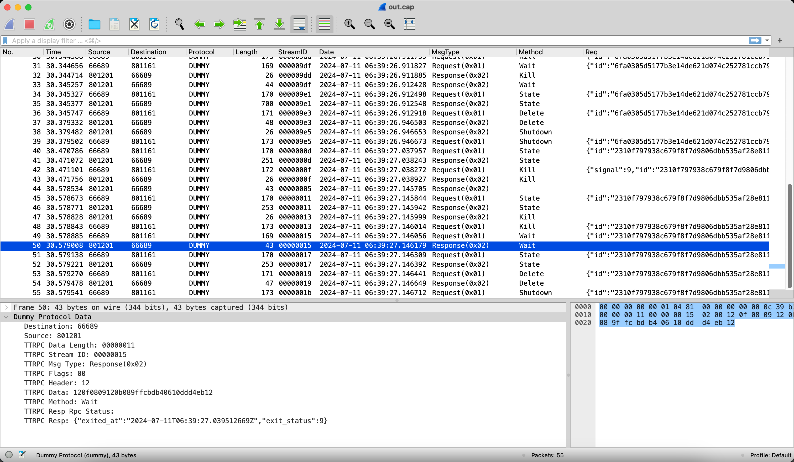
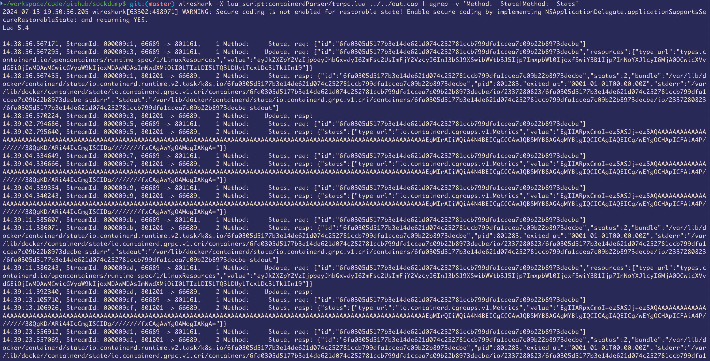

# Wireshark - Network protocol analyzer

## 1. grpc (http over unix socket)
```
./sockdump.py /var/run/docker.sock --format pcap --output dump.pcap

wireshark -X lua_script:wireshark/dummy.lua dump.pcap
```
## 2. ttrpc (ttrpc over unix socket)
[What is ttrpc? see this.](https://github.com/containerd/ttrpc)

TTRPC is used for containerd-shim <-> containerd communication.

```
./sockdump.py /run/containerd/s/22b4cfa50741b1a0f8645eba9fdccbdde84e0ea9d02cfbb498e36dba8be2fc32 --format pcap --output dump.pcap

cd containerdParser
make linux-amd64
#make linux-arm64
#make mac-amd64
#make mac-arm64
cd ../

wireshark -X lua_script:containerdParser/ttrpc.lua dump.pcap
```



